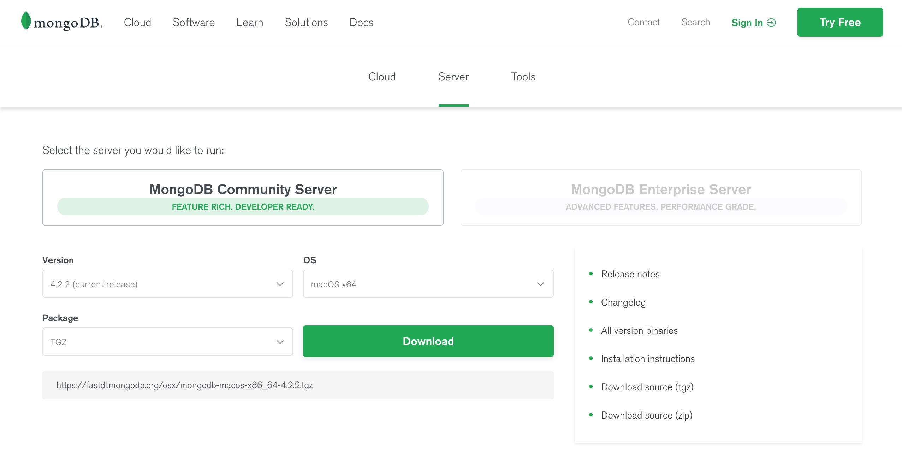

# 一、概述

MongoDB 是一个文档数据库，提供好的性能，领先的非关系型数据库。采用BSON存储文档数据。BSON是一种类json的一种二进制形式的存储格式，简称：Binary JSON。相对于json多了date类型和二进制数组。

# 二、下载

## 1. macOS

### 1.1. 下载

**# [官网下载](https://www.mongodb.com/download-center/community)**

\1. 官网下载相应版本



\2. 将压缩包解压至你想放的任意位置，我这里放在 “/usr/local/” 目录下，并重新命名为 “mongodb”。

\3. 添加环境变量

```shell
$ open ~/.bash_profile
```

\4. 添加如下代码

```shell
export PATH=$PATH:/usr/local/mongodb/bin 
```

\5. 查看版本，如果正常显示版本号则安装成功

```shell
$ mongo --version
MongoDB shell version v4.2.2
git version: a0bbbff6ada159e19298d37946ac8dc4b497eadf
allocator: system
modules: none
build environment:
    distarch: x86_64
    target_arch: x86_64
```

**# Brew 下载**

[参考地址 >>](https://docs.mongodb.com/manual/tutorial/install-mongodb-on-os-x/)

```shell
$ brew tap mongodb/brew
$ brew install mongodb-community@4.2
$ mongo --version
MongoDB shell version v4.2.2
git version: a0bbbff6ada159e19298d37946ac8dc4b497eadf
allocator: system
modules: none
build environment:
    distarch: x86_64
    target_arch: x86_64
```

### 1.2. 创建目录

```shell
$ sudo mkdir -p /data/db
$ sudo mkdir -p /data/logs
$ cd /data/logs
$ touch mongodb.log
$ sudo chown -R 当前登录的用户名  /data
```

### 1.3. 配置文件

```shell
$ vim /etc/mongodb.conf
```

按 `i` 输入如下内容：

```ini
# 数据库存放地址
dbpath=/data/db
# 日志输出文件路径
logpath=/data/logs/mongodb.log
# 错误日志采用追加模式，配置这个选项后mongodb的日志会追加到现有的日志文件，而不是从新创建一个新文件
logappend=true
# 启用日志文件，默认启用
journal=true
# 这个选项可以过滤掉一些无用的日志信息，若需要调试使用请设置为false
quiet=true
# 端口号
port=27017
# 守护进程
fork=true
# 绑定ip
bind_ip=127.0.0.1
```

按 `ESC` 输入 `:wq!` 保存退出！

### 1.4. 运行

```shell
# 通过配置文件启动mongodb
$ mongod -f /etc/mongodb.conf
```

如果出现successful就表示服务已经启动成功

浏览器输入：

```
http://localhost:27017/
```

网页呈现如下信息即表示成功：

```markdown
It looks like you are trying to access MongoDB over HTTP on the native driver port.
```

> 提示：后续使用mongodb只需要打开终端输入mongo指令即可。

### 1.5. 修改配置文件后重新启动

\1. 打开mac 启动台 -> 其他 -> 活动监视器，删除 mongodb 服务

\2. 删除 mongod.lock 文件

\3. 终端执行 mongod --repair

\4. 根据配置文件启动：mongod -f /etc/mongodb.conf

## 2. Windows

# 三、概念

| SQL术语/概念 | MongoDB术语/概念 | 解释/说明                           |
| :----------- | :--------------- | :---------------------------------- |
| database     | database         | 数据库                              |
| table        | collection       | 数据库表/集合                       |
| row          | document         | 数据记录行/文档                     |
| column       | field            | 数据字段/域                         |
| index        | index            | 索引                                |
| table joins  |                  | 表连接,MongoDB不支持                |
| primary key  | primary key      | 主键,MongoDB自动将_id字段设置为主键 |

通过下图实例，我们也可以更直观的了解Mongo中的一些概念：


